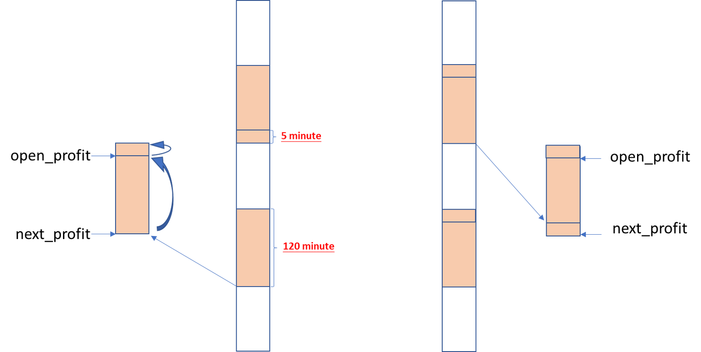

# 聚宽学习周记二二：详解@云帆的“高频因子探索——动量交易”（上）

本周继续学习@云帆的[高频因子探索——动量交易](https://www.joinquant.com/view/community/detail/22472)，先将其中的代码解释完。

## 一、代码解释

### 代码片段1

```
#对每一天的数据分组，多天数据合并

def get_day_profit(day_data,date,sel_n):
    '''
    获取每天的收益列表，

    '''
    day_data = day_data.dropna()
    new_col = ['back_profit','open_profit','next_profit']
    day_data = day_data[new_col]
    #删除开盘没有涨跌的股票
    sel_data = day_data[day_data['open_profit'] == 0].index
    day_data = day_data.drop(sel_data,axis=0)
    cut_day_data = cut_data(day_data,cut_layer)
    col = cut_day_data.columns
    #选出对应股票
    #sel_day_data = cut_day_data[col[0]][cut_day_data[col[0]] == sel_n]
    #sel_day_stocks = list(sel_day_data.index)

    group_day_data = cut_day_data.groupby(['open_profit']).mean()
    day_profit = group_day_data.iloc[sel_n-1,-1]
    day_profit = pd.DataFrame([day_profit],index=[date],columns=['profit'])
    return day_profit
```

这个函数是按天来对某一天的动量数据进行分层处理，“分层”上周已经提到过，是用百分位（划分为1~10档）来替换以涨幅表示的动量数据。之后按照开盘价`open_profit`进行分组，且选择开盘价动量值最大的分组对应收益的均值。

这里解释下pandas里面`groupby()`函数的用法。函数`groupby()`是对DataFrame进行分组，这个分组的操作通常仅仅是一系列操作中的排头阵。也就是说，我们在应用`groupby()`这个函数不仅是“为了分组而分组”，而是“为了更重要的目的不得不先进行分组”。

比如，下面的例子展示的是求取每组分组的均值。在这个例子里面我们分组不是目的，而求取每个分组才是目的。这个例子很形象，理解了它再去理解上面代码里面中`groupby()`的应用就更容易了。

```
df = pd.DataFrame({'Animal': ['Falcon', 'Falcon',
                              'Parrot', 'Parrot'],
                   'Max Speed': [380., 370., 24., 26.]})
df
   Animal  Max Speed
0  Falcon      380.0
1  Falcon      370.0
2  Parrot       24.0
3  Parrot       26.0
df.groupby(['Animal']).mean()
        Max Speed
Animal
Falcon      375.0
Parrot       25.0
```

参考：

- [pandas.DataFrame.groupby](https://pandas.pydata.org/pandas-docs/stable/reference/api/pandas.DataFrame.groupby.html)


### 代码片段2

```
#选择每天的分层数据中收益较高的层
sel_n = 8
day_profit_l = []
for key in keys:
    day_data = dic_res[key]

    day_profit = get_day_profit(day_data,key,sel_n)
    day_profit_l.append(day_profit)
profit_df = pd.concat(day_profit_l)
```

这段代码是对上面定义的函数`get_day_profit()`的使用，通过它来获取每天的分层对应的收益数据，保存起来。这里每天的分层收益数据都是一个DataFrame类型的数据，比如获取到的2019-09-02这天的数据是下面这样：

```
            profit
2019-09-02  0.011311
```

连续多天的这样的数据保存在列表里面，最后使用`concat()`函数将多个日期的按照动量分层之后的数据拼接为一个DataFrame数据，就成了下面这样：

```
            profit
2019-09-02  0.011311
2019-09-03 -0.002441
2019-09-04  0.004716
```

### 代码片段3

```
index = list(profit_df.index)
base_start_date = index[0]
base_end_date = index[-1]
base_price = get_price('000300.XSHG',start_date=base_start_date,end_date = base_end_date,fields=['close'])['close']
profit_df['cum_profit'] = (profit_df['profit'] + 1).cumprod()

#计算基准收益，以沪深300为准
base_price = get_price('000300.XSHG',start_date=base_start_date,end_date = base_end_date,fields=['close'])['close']
base_pofit = base_price.pct_change().dropna()
base_profit_cump = (base_pofit + 1).cumprod()
index = list(base_profit_cump.index)
new_index = [datetime.datetime.strftime(i,'%Y-%m-%d') for i in index ]
base_profit_cump.index = new_index
base_profit_cump.name = 'base_profit'

profit_df_combine = pd.concat([profit_df,base_profit_cump],axis=1).dropna()
print(profit_df_combine.tail())

draw_profit = profit_df_combine[['cum_profit','base_profit']]
draw_profit.plot(figsize=(15,8))
plt.show()
base_profit_show = profit_df_combine['base_profit'][-1]
stratage_profit_show = profit_df_combine['cum_profit'][-1]
print('base profit is: %s'%(str(round((base_profit_show-1)*100,2)) + '%'))
print('strage profit is: %s'%(str(round((stratage_profit_show-1)*100,2)) + '%'))

max_drawdown = find_max_drawdown(profit_df_combine['cum_profit'])
print('max drawdown is: %s' %(str(round(max_drawdown*100,2)) + '%'))
```

## 上周计划

### 1. 继续学习@云帆的[高频因子探索——动量交易](https://www.joinquant.com/view/community/detail/22472)。

重复理解了一下原文中的`get_profit_minutes_period()`和`get_open_profit_minutes_period()`函数，始终觉得有难以理解的地方。重新理解如下：

函数`get_profit_minutes_period()`的注释是“计算date前一天最后一段时间的动量收益，n为开盘收益计算时间长度，next_n为开盘后收益计算长度”，但到底是什么意思呢？我们假设按照默认值n=5, next_n=120来理解，那么：

- `open_profit`列的数据为下午开盘后1分钟相对于前5分钟的动量数据。*衡量下午开盘时的动量。*
- `next_profit`列的数据为下午开盘后120分钟的数据相当于前120分钟，即下午收盘时相对于下午开盘时的动量。*衡量下午收盘时的动量。*

函数`get_open_profit_minutes_period()`的注释是“计算date前一天开盘的动量收益，n为开盘收益计算时间长度，next_n为开盘后收益计算长度”，我们依然按照默认值n=5, next_n=120来理解，由于函数中获取到的是前一天240分钟（即整天的行情数据），那么：

- `open_profit`列的数据为上午开盘后5分钟相对于上午开盘时的动量数据。*衡量上午开盘时的动量。*
- `next_profit`列的数据为下午开盘后5分钟相对于上午开盘时的动量数据。*衡量上午收盘时的动量。*

我在阅读代码的时候始终觉得这两个函数似同似异，就算写出自己的理解也没有完全明白，于是只好画了下面这张图才算明白了：



按如上图示，这两个函数一个计算上午开盘和收盘的动量，另一个计算下午开盘和收盘的动量，两者计算开盘和收盘动量的计算长度不一样。相同点在于两个函数开盘时都按5分钟时长进行计算，收盘时都按120分钟进行计算；不同点在于计算上午收盘时的动量取用了下午开始5分钟做为补充数据，而计算下午开盘时动量取用了上午最后5分钟作为补充数据。

为什么要这么上下补充呢，可能的原因为：当前是为了以半天为粒度来衡量消息面的影响，所以都是默认以120分钟做为计算动量的时间长度。而按照5分钟的步长来计算开盘时动量时，如果以上午第1分钟来计算动量那么就需要获取前一天的数据了，这样显得负杂，所以就有了：1，以上午开盘后5分钟来获取开盘时动量数据，然后再顺眼120分钟获取上午收盘时的动量。2，下午开盘第1分钟直接计算相对于前5分钟的步长。

我在这里的想法是，如果要衡量消息面在上午、下午开盘/收盘之间的关系来进行高频交易，那么实际上我们可以不用进行5分钟补位的操作，而直接计算：

- 上午开盘后5分钟的动量数据，上午收盘时的动量数据；
- 下午开盘后5分钟的动量数据，下午收盘时的动量数据；


2. 基于本周学习到的新的动量计算算法，以及前面两周研究指数上面的一些理解，尝试着写作基于ETF的交易策略。

## 下周计划
